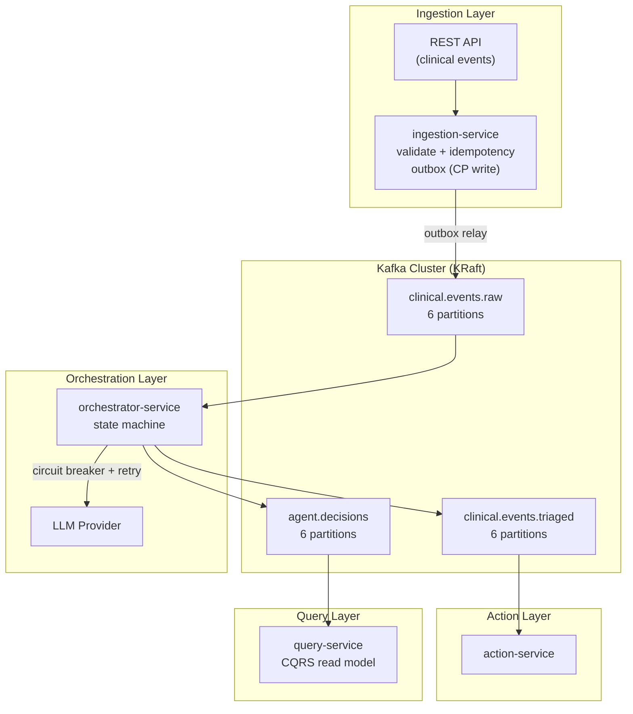

# High-Level Design (HLD)

## 1. System Context

The Event-Driven AI Agent Orchestration Platform handles the asynchronous, reliable processing of synthetic clinical events through a sequence of AI agents. The overarching design mandate is **reliability under failure**. The system must gracefully handle network partitions, LLM rate limits, and service outages without dropping a single event or executing a single duplicate action.

## 2. Architecture Diagram

## 3. Core Trade-offs & CAP Theorem Analysis

### 3.1. Ingestion: CP (Consistency / Partition Tolerance)
* **Design:** When the `ingestion-service` receives an API request, it saves the event payload AND an outbox entry to PostgreSQL in a single `@Transactional` boundary.
* **Why:** We choose **Consistency** over Availability. If Postgres is down, we actively reject the HTTP request (500) rather than accepting it in memory and risking data loss if the pod crashes.
* **Outcome:** Zero message loss. If Kafka is down, the HTTP request still succeeds (202 Accepted) because the outbox relay operates asynchronously.

### 3.2. Query Service: AP (Availability / Partition Tolerance)
* **Design:** The `query-service` builds its own read model by consuming the `agent.decisions` Kafka topic.
* **Why:** We choose **Availability**. The dashboard must always render. The data may be a few seconds stale (eventual consistency), but read operations are entirely decoupled from the heavy write paths of the Orchestrator.

### 3.3. Kafka Publish Reliability: Outbox vs. Dual-Write
* **Design:** Transactional Outbox Pattern.
* **Why:** "Dual-writes" (writing to DB and then immediately publishing to Kafka in the same thread) are an anti-pattern. If the DB commits but Kafka times out, the system state diverges. The Outbox ensures local DB commit guarantees the eventual publish.

## 4. Resilience Patterns
1. **Idempotency Everywhere:** Every layer deduplicates. The Ingestion service deduplicates API calls by `idempotencyKey`. The Orchestrator deduplicates Kafka messages by `eventId`. The Action service deduplicates before sending notifications.
2. **Circuit Breaking:** The Orchestrator wraps LLM calls in a Resilience4j Circuit Breaker. If the LLM has an outage, the breaker opens, instantly failing subsequent calls locally rather than tying up threads waiting for timeouts.
3. **Consumer Backpressure:** When the Orchestrator's Circuit Breaker opens, or its Redis Token Budget exhausts, it actively pauses (`KafkaConsumer.pause()`) the Kafka listener. It resumes only when capacity returns. This prevents pulling messages off the queue only to fail them locally.
